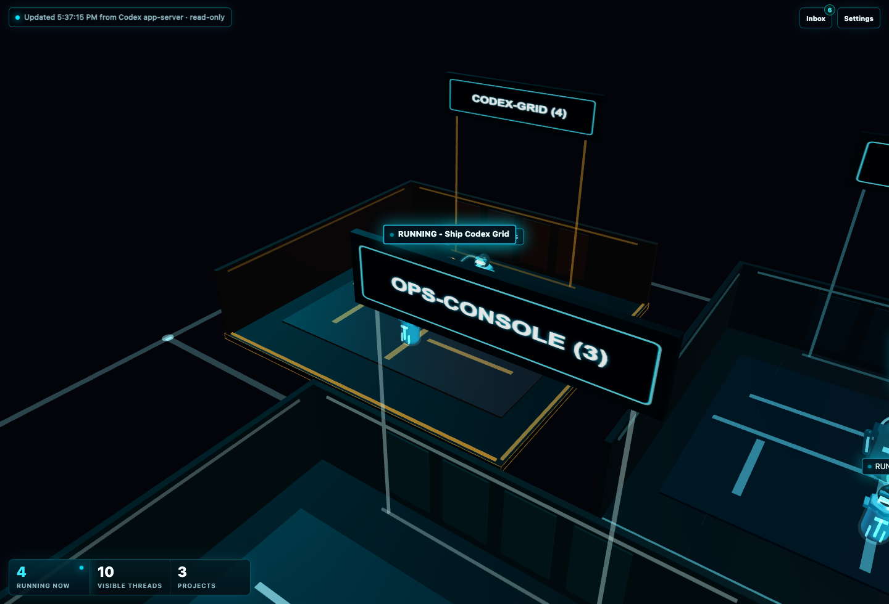
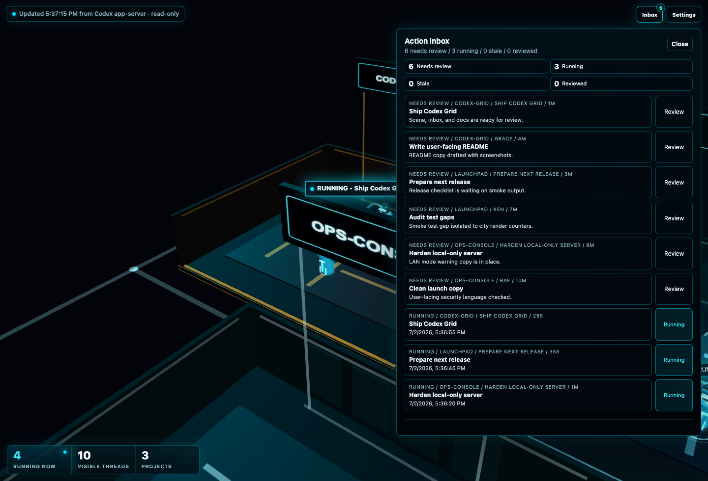

# Codex Grid

[](https://github.com/jdelaire/codex-grid/actions/workflows/ci.yml)

Codex Grid is a local 3D command center for Codex threads and subagents. It turns your parallel coding work into a neon grid: projects become rooms, main threads become larger programs, child agents move around them, and handoffs light up as work flows through the system.

It is built for the moment when one terminal is no longer enough and you want to see the whole agent city at once.



## What You See

- Project rooms for every active workspace.
- Parent threads as larger programs with child agents orbiting around them.
- Active, done, stale, and reviewed work states at a glance.
- Handoff arcs between main threads and subagents.
- A review inbox for work that needs attention.
- Privacy mode when you need labels hidden on screen.



Screenshots use synthetic demo data.

## Why It Exists

Codex can run across multiple projects and delegate work to subagents. That is powerful, but it is easy to lose track of what is running, what finished, and what needs review. Codex Grid gives that activity a spatial model: one local WebGL scene, one glanceable operations floor, no hosted backend.

The vibe is Codex meets a neon arcade grid, but the implementation stays small:

- Python stdlib server.
- Static browser frontend.
- Vendored Three.js runtime.
- No React, bundler, database, hosted backend, or API keys.

## Quick Start

Requirements:

- macOS or another local environment with Codex CLI installed.
- Python 3.11 or newer.
- A browser with WebGL.

Run the local server:

```bash
python3 server.py --port 8765
```

Open:

```text
http://127.0.0.1:8765/
```

Or use the macOS launcher:

```bash
./launch.sh
```

Override defaults:

```bash
HOST=127.0.0.1 PORT=9000 CODEX_BIN=codex ./launch.sh
```

The server reads Codex state through:

```bash
codex app-server --listen stdio://
```

## Privacy Model

Codex Grid is local-first. By default it binds to `127.0.0.1`, so your local Codex thread metadata is not exposed on your LAN.

LAN access is opt-in:

```bash
python3 server.py --host 0.0.0.0 --port 8765
```

Only use LAN mode on a trusted network. Codex Grid has no authentication layer and displays local Codex thread metadata.

Do not commit local Codex state databases, `.env` files, logs, keys, screenshots with private content, or exported thread dumps.

## Current Status

Codex Grid is a read-only monitor today. Message sending is intentionally disabled server-side while the interaction model is being shaped.

## Development

Install browser-test dependencies:

```bash
npm ci
npx playwright install --with-deps chromium
```

Run checks:

```bash
python3 -m unittest -v
npm run test:js
npm run test:smoke
```

## API

```text
GET /api/threads?maxAgeHours=8
GET /api/thread/<thread-id>
POST /api/thread/<thread-id>/message
```

`POST /api/thread/<thread-id>/message` currently returns a disabled response.

## License

MIT
